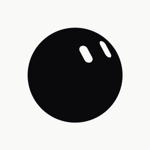
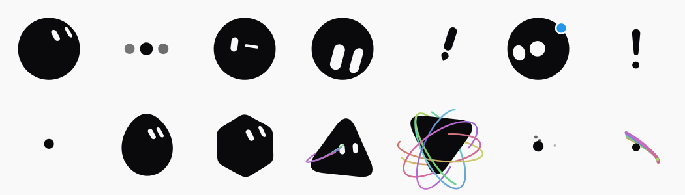

# xBot

Vue 3 SVG avatar: one filled shape morphing through 14 states, two eyes as mask holes. No animation library.



Demo: [bot.uilist.com](https://bot.uilist.com/)

## Install (npm)

```bash
npm install xbot
# peer: vue ^3.5
```

```vue
<script setup>
import { XBot } from 'xbot'
</script>

<template>
  <XBot :size="120" color="#3b93f0" />
  <XBot :size="64" color="encre" shape="squircle" />
</template>
```

| Prop | Description |
| --- | --- |
| `size` | Width/height in px (default `320`) |
| `color` | Palette id (`encre`, `bleu`, …) or `#rgb` / `#rrggbb` |
| `shape` | Body shape id (default `cercle`) |
| `expression` | Rest face id (default `neutre`) |
| `paper` | Background behind the eyes (default `#f9f9f9`) |
| `frozenAt` | Freeze at time in seconds (no animation loop) |
| `follow` | Eyes follow the pointer |

Also exported: `COLORS`, `SHAPES`, `EXPRESSIONS`, types. Models: `v-model:state`, `v-model:playing`, `v-model:block`, `v-model:elapsed`.

## 安装（npm）

```bash
npm install xbot
# 需要 peer：vue ^3.5
```

```vue
<script setup>
import { XBot } from 'xbot'
</script>

<template>
  <XBot :size="120" color="#3b93f0" />
  <XBot :size="64" color="encre" shape="squircle" />
</template>
```

| 属性 | 说明 |
| --- | --- |
| `size` | 宽高（像素），默认 `320` |
| `color` | 预设 id（如 `encre`、`bleu`）或 `#rgb` / `#rrggbb` |
| `shape` | 身体形状 id，默认 `cercle` |
| `expression` | 静止表情 id，默认 `neutre` |
| `paper` | 眼洞后的底色，默认 `#f9f9f9` |
| `frozenAt` | 定格到某一秒（不跑动画循环） |
| `follow` | 眼睛跟随鼠标 |

另导出 `COLORS`、`SHAPES`、`EXPRESSIONS` 及类型；可用 `v-model:state` / `playing` / `block` / `elapsed`。

## Running the demo site

```bash
pnpm install
pnpm dev
```

Then open http://localhost:5190.

```bash
pnpm test     # vitest
pnpm build    # vue-tsc --noEmit && vite build
pnpm build:lib # npm package → lib/
pnpm pack:local && pnpm playground # test packed tarball → :5191
```

Vue 3, Vite, TypeScript, Tailwind 4. No ESLint and no Prettier: `vue-tsc` is the only gate, so run `pnpm build` before you call something done.

## What's in it

The rail on the left switches between three views. **Customise** offers 8 body shapes, 12 colours and 16 rest expressions, kept between visits. **Animations** is a small editor: arrange states into a timeline, set how long each is held, save the result. **Settings** holds the language (French, English or Chinese) and the credits.

Anything on screen can be exported: the avatar as SVG, PNG or an animated GIF, and a whole timeline as GIF or MP4. The still formats need no library at all, and the video encoder is only fetched the first time you ask for one.

Two URLs are worth knowing:

- `#planche`: the 14 states side by side, frozen. Quick visual check.
- `#etat=orbit&stop`: opens one state directly, playback paused.



## Why the numbers look arbitrary

They're measured, not chosen. The reference video was cut at 10 fps and each state measured off the frames: silhouettes by sub-pixel ray casting, eyes by capsule fitting, colours and stroke widths by direct sampling.

So the constants in the code are **measurements**, and rounding them to friendlier values breaks the resemblance, which is the only thing this project is trying to get right. A few are counter-intuitive enough to be worth knowing before you correct anything:

| What you'd assume | What the video shows |
| --- | --- |
| The eyes lean `//` | They lean `\\`, around 26° off vertical |
| The body is a squircle | It's a perfect circle, radial deviation under 0.7% |
| Transitions are springs | Exponential ease-outs; the body never overshoots |
| The comet crosses the screen | The dot stays put, the trail orbits it |
| The avatar floats at rest | It doesn't. The life is gaze drift and blinking |

[docs/measurements.md](docs/measurements.md) has the rest, including how to regenerate the extracted profiles.

## How it's put together

`src/bot/` is framework-free and clock-free: `engine.sample(t)` is a pure function of time. Pausing, resuming, jumping to an arbitrary date and running tests all produce the same image, which is what makes the frozen state board and the DOM-less test suite possible.

|  |  |
| --- | --- |
| [docs/architecture.md](docs/architecture.md) | The engine, radial-profile morphing, eyes as mask holes |
| [docs/measurements.md](docs/measurements.md) | What was measured, and regenerating `profiles.ts` |
| [docs/intro.md](docs/intro.md) | The arrival sequence, and why it only plays one state |
| [docs/interface.md](docs/interface.md) | Layout, the three-column scene, CSS traps |
| [docs/export.md](docs/export.md) | Exporting to SVG, PNG, GIF and MP4 |
| [docs/i18n.md](docs/i18n.md) | The hand-rolled translation layer |

## Changes

[CHANGELOG.md](CHANGELOG.md), one entry per release — which is how you tell whether the copy you have carries a given fix.

## License

MIT. See [LICENSE](LICENSE).

Not affiliated with, endorsed by or connected to x.ai. It recreates the visual behaviour of their bot avatar as an exercise; "Grok" and "x.ai" belong to their owners. The MIT licence covers the code in this repository, not the design it imitates.
